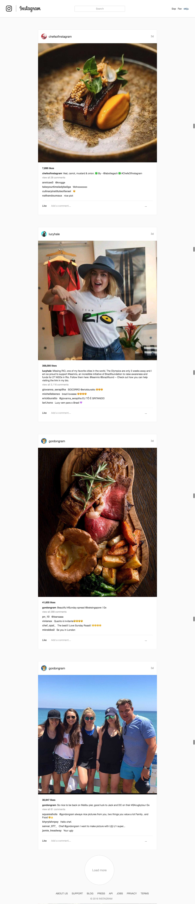

# react-write-finer-pages

> Rewrite finer web pages in ReactJS

[Demo](http://danielzhu.github.io/react-write-finer-pages/#/trello)

### How to Run

- Clone project

`git clone git@github.com:DanielZhu/react-write-finer-pages.git .`

- Install the dependenies

```
cd react-write-finer-pages
npm install
```

- Run the service

`npm run start`

- Visit Trello pages

Open `http://0.0.0.0:3000/#/trello` to visit the demo

### Trello Re-implementation

#### My Boards Page(Home for Personal)


#### Board Detail Page


- Visit Instagram pages

Open `http://0.0.0.0:3000/#/instagram` to visit the demo

### Instagram Re-implementation

#### Index Page



Copyright to @2016 [Staydan.com](http://staydan.com)
